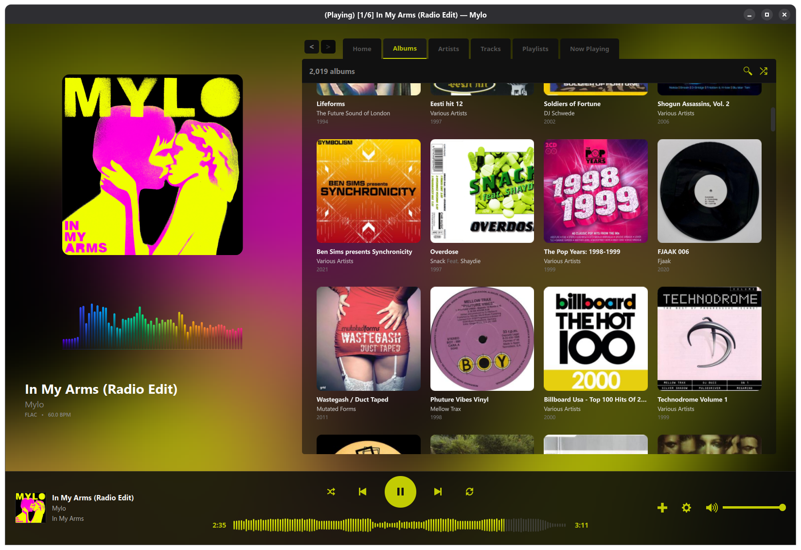
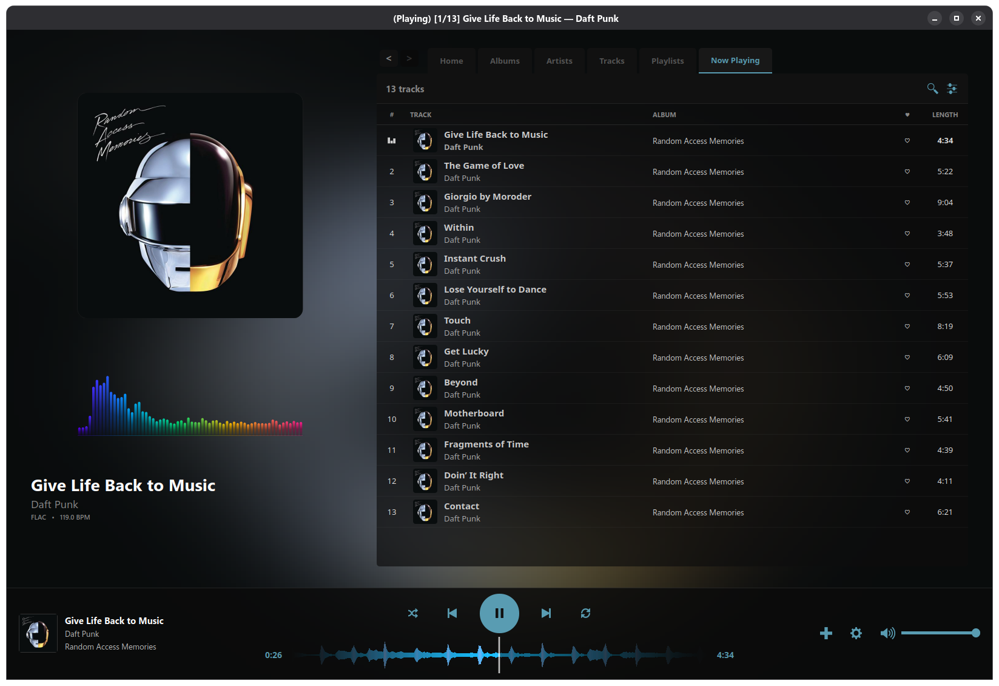
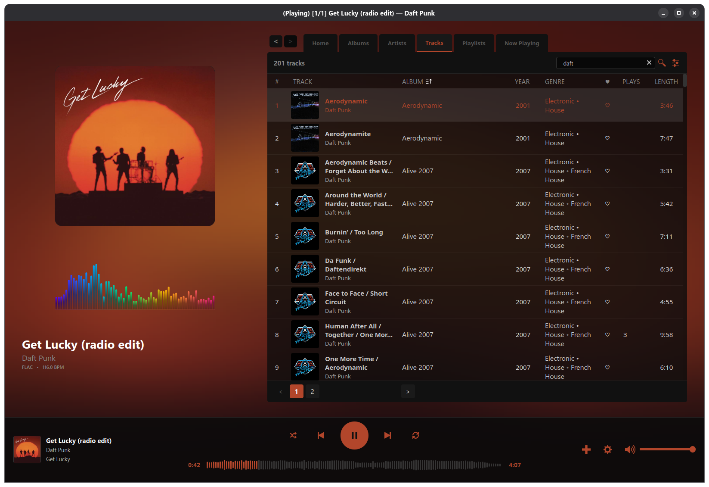
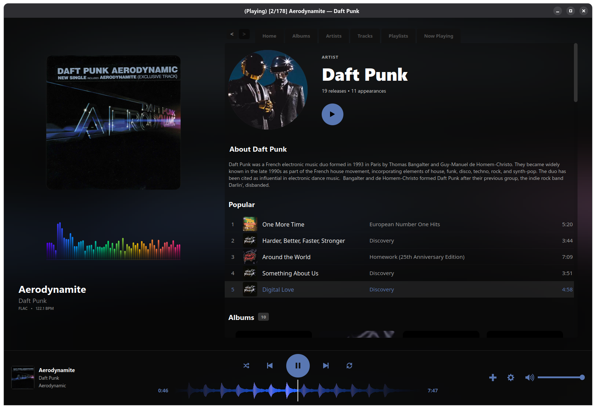

# Sonar Music Player

Keyboard warrior friendly desktop music player for self-hosted [Navidrome](https://www.navidrome.org/) servers (Subsonic-compatible API). Built with Python/PyQt6 and a custom C++ audio engine for gapless playback.


---

## Screenshots

| Albums | Now Playing |
|--------|-------------|
|  |  |

| Tracks & Search | Artist Page |
|-----------------|-------------|
|  |  |

---

## Features

- **Gapless playback** — tracks cross-fade seamlessly via the C++ engine
- **Waveform scrubber** — real-time waveform display with turntable scratch mode
- **BPM detection** — automatic BPM analysis cached per track (via SoundTouch Audio Processing Library)

- **Dynamic theming** — accent colour extracted from album art
- **Spotlight search** — global search across artists, albums, and tracks
- **Media key support** — play/pause/next/prev via keyboard media keys (Windows & Linux)
- **Crossfade backgrounds** — blurred album art as the window background
- **Now Playing queue** — drag-to-reorder, favourite toggling, column resize

---

## Requirements

- Python 3.10+
- A running [Navidrome](https://www.navidrome.org/) server (or any Subsonic-compatible server)
- A C++ compiler (g++) to build the audio engine

---

## Installation

### 1. Clone the repository

```bash
git clone https://github.com/raudraido/Sonar.git
cd Sonar
```

### 2. Install Python dependencies

```bash
pip install -r requirements.txt
```

**Linux only** — install evdev for media key support:
```bash
pip install evdev
```

### 3. Build the C++ audio engine

The player depends on a compiled shared library (`audio_core.dll` on Windows, `audio_core.so` on Linux).

**Dependencies for the C++ build:**

| Platform | Required |
|----------|----------|
| Windows  | g++ (MinGW), libcurl (`-I C:/curl/include -L C:/curl/lib`) |
| Linux    | g++, libcurl (`sudo apt install libcurl4-openssl-dev`) |

**Build:**
```bash
python build.py
```

This compiles `audio_core.cpp` (with SoundTouch for pitch-correct scratch) and outputs the `.dll` / `.so` file in the project root.

### 4. Run

```bash
python main.py
```

On first launch you will be prompted to enter your Navidrome server URL, username, and password. Credentials can optionally be saved to your OS keyring.

---

## Project Structure

```
raud-player/
├── main.py                  # Entry point and main window (RRPlayer)
├── audio_engine.py          # Python wrapper around the C++ engine
├── audio_core.cpp           # C++ audio engine (miniaudio + SoundTouch)
├── build.py                 # Compiles audio_core.cpp → .dll/.so
├── build_exe.py             # Packages the app with PyInstaller
├── cover_cache.py           # Two-tier album art cache (memory + disk)
├── subsonic_client.py       # Navidrome / Subsonic API client
├── login_dialog.py          # Server connection dialog
├── now_playing.py           # Now Playing queue panel and tree widget
├── library_browser.py       # Albums grid browser and album detail view
├── artists_browser.py       # Artists grid browser and artist detail view
├── tracks_browser.py        # Flat tracks list browser
├── playlists_browser.py     # Playlists browser and playlist detail view
├── home.py                  # Home tab (recently played, random albums)
├── spotlight_search.py      # Global search overlay
├── visualizer.py            # Frequency bar visualizer widget
├── waveform_scrubber.py     # Waveform / seek bar widget
├── waveform_renderer.py     # SoundCloud-style bar renderer (helper)
├── components.py            # Shared UI components
├── requirements.txt
└── img/                     # Icons and default artwork
```

---

## Building a Standalone Executable

```bash
python build_exe.py
```

This uses PyInstaller to produce a single-file executable in `dist/`. The C++ `.dll`/`.so` is bundled automatically.

---

## Linux Media Keys

The Linux media key listener reads directly from `/dev/input/`. Your user may need to be in the `input` group:

```bash
sudo usermod -aG input $USER
# Log out and back in for this to take effect
```

The player auto-detects the correct input device at startup.

---

## Configuration

All settings are stored via Qt's `QSettings` (registry on Windows, `~/.config` on Linux). Passwords are stored in the OS keyring — never in plain text.

---

## Contributing

Pull requests are welcome. Please open an issue first for anything larger than a bug fix.

---

## License

MIT
